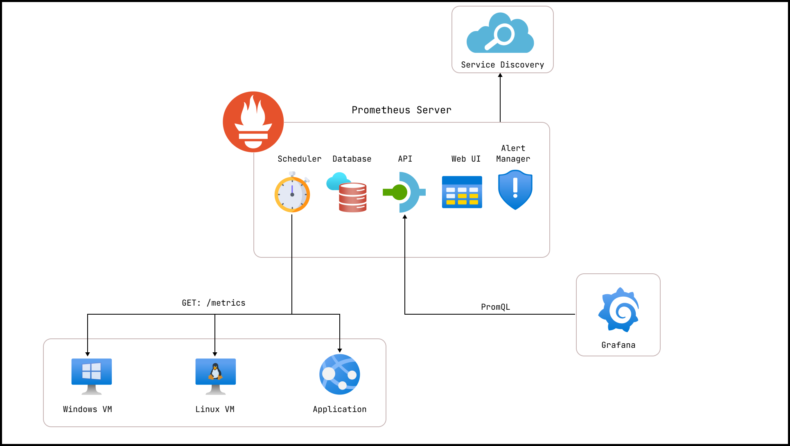

# Prometheus

Deploying Prometheus server on Linux using Bash and Terraform `remote-exec`provisioners.
Set up Linux & Windows VMs as scrape targets, automate Prometheus Node Exporters via Azure Custom Script Extensions,
PowerShell and Bash.
Configure the Prometheus server using Bash and Terraform `remote-exec` provisioners.

- https://dev.azure.com/PetroKolosovProjects/PrometheusLearning

## Configure Alert Manager

- `wget -qO- https://raw.githubusercontent.com/kolosovpetro/Prometheus/refs/heads/master/scripts/Install-AlertManager.sh | sudo bash`
- `wget -qO- https://raw.githubusercontent.com/kolosovpetro/Prometheus/refs/heads/master/scripts/Install-AlertManager-Config.sh | sudo bash`
- `wget -qO- https://raw.githubusercontent.com/kolosovpetro/Prometheus/refs/heads/master/scripts/Install-AlertManager-Service.sh | sudo bash`

## Exporters

- Master node: https://github.com/prometheus/prometheus
- Alert manager: https://github.com/prometheus/alertmanager
- Linux node exporter: https://github.com/prometheus/node_exporter
- Windows node exporter: https://github.com/prometheus-community/windows_exporter

## DNS

- [Prometheus Server HTTP Nginx](http://prometheus-master.razumovsky.me)
- [Prometheus Server Web UI](http://prometheus-master.razumovsky.me:9090)
- [AlertManager Web UI](http://prometheus-master.razumovsky.me:9093)
- [Grafana Web UI](http://prometheus-master.razumovsky.me:3000/login)
- [Linux Node HTTP Nginx](http://linux-target.razumovsky.me)
- [Prometheus Linux Node Exporter Metrics](http://linux-target.razumovsky.me:9100/metrics)
- [Windows Node HTTP IIS](http://windows-target.razumovsky.me)
- [Prometheus Windows Node Exporter Metrics](http://windows-target.razumovsky.me:9182/metrics)

## SSH connection

- ssh razumovsky_r@prometheus-master.razumovsky.me
- ssh razumovsky_r@linux-target.razumovsky.me
- ssh -o StrictHostKeyChecking=no razumovsky_r@prometheus-master.razumovsky.me
- ssh -o StrictHostKeyChecking=no razumovsky_r@linux-target.razumovsky.me

## Configure Prometheus and Grafana

- Prometheus Server:
  `wget -qO- https://raw.githubusercontent.com/kolosovpetro/Prometheus/refs/heads/master/scripts/Install-Linux-Prometheus-Server.sh | sudo bash`
- Grafana:
   `wget -qO- https://raw.githubusercontent.com/kolosovpetro/Prometheus/refs/heads/AZ400-327/scripts/Install-Grafana.sh | sudo bash`
- Prometheus Linux Node exporter:
  `wget -qO- https://raw.githubusercontent.com/kolosovpetro/Prometheus/master/scripts/Install-Linux-Node-Exporter.sh | sudo bash`
- Prometheus Windows Node exporter:
  `$scriptUrl = "https://raw.githubusercontent.com/kolosovpetro/Prometheus/master/scripts/Install-Windows-Exporter.ps1";$localScriptPath = "$env:TEMP\Install-Windows-Exporter.ps1";Invoke-WebRequest -Uri $scriptUrl -OutFile $localScriptPath;PowerShell -ExecutionPolicy Bypass -File $localScriptPath`

## Notes

- Linux default scrape port: 9100
- Windows default scrape port: 9182
- WinRM HTTP port: 5985
- WinRM HTTPS port: 5986

## Docs

- Daemon using outdated libraries fix: https://stackoverflow.com/q/73397110
    - `/etc/needrestart/needrestart.conf`
    - `$nrconf{restart} = 'a';`
    -
  `sudo curl -o /etc/needrestart/needrestart.conf https://raw.githubusercontent.com/kolosovpetro/prometheus-learning/refs/heads/master/needrestart.conf`

## Terraform provisioners

- Terraform remote exec
  provisioner: https://developer.hashicorp.com/terraform/language/resources/provisioners/remote-exec
- Terraform file provisioner: https://developer.hashicorp.com/terraform/language/resources/provisioners/file
- Cloudflare provider: https://registry.terraform.io/providers/cloudflare/cloudflare/latest/docs

## Prometheus and Its Components

**Prometheus** is an open-source monitoring and alerting toolkit designed for recording real-time metrics in a
time-series database. It supports flexible queries and provides robust alerting capabilities.

### Key Components of Prometheus:

1. **Prometheus Server**
   The core component responsible for collecting, storing, and querying time-series data. It pulls metrics from defined
   endpoints by scraping them at specified intervals.

2. **Service Discovery**
   Automatically detects targets to scrape metrics from, reducing the need for manual configuration. This allows
   Prometheus to dynamically adapt to changes in infrastructure.

3. **Alert Manager**
   Manages alerts generated by the Prometheus server, deduplicating and routing them to appropriate notification
   channels like email, Slack, or PagerDuty.

4. **Scheduler**
   Handles the periodic task of scraping metrics from targets and storing them in the time-series database. It ensures
   consistent data collection.

5. **Web UI**
   Provides a basic interface for exploring metrics and running queries directly in Prometheus. Users can visualize data
   and validate queries using PromQL.

6. **PromQL (Prometheus Query Language)**
   A powerful query language used to retrieve and manipulate time-series data. It supports various functions for
   aggregating and analyzing metrics.

## Prometheus diagram

